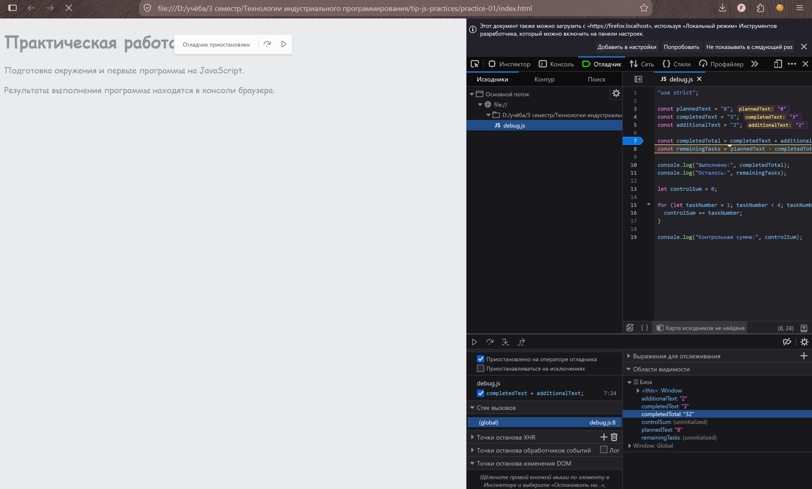

Засимов Фёдор Петрович ЭФБО-05-25
#### Вариант: 3 (totalTasks=9, completedTasks=9, dailyLimit=3)
#### Окружение:
ОС Windows 11
npm --version
11.12.1
git --version
git version 2.54.0.windows.1
node --version
v24.15.0
браузер - firefox
## Запуск
Команды выполняются из корня репозитория:
node practice-01/js/hello.js
node practice-01/js/types.js
node practice-01/js/progress.js
node practice-01/js/plan.js
node practice-01/js/debug.js
node practice-01/js/progress-input.js

## Задание 1:
Код идентичен, но последняя строка отличается - в терминале это undefined, а в консоли браузера object.
Причина: `document` — это **не часть языка JavaScript**, а **объект окружения (хост-объект)**, который предоставляет браузер. Он представляет собой корень DOM-дерева текущей HTML-страницы.
Разница в поведении объясняется тем, что **Node.js и браузер — это два разных окружения выполнения JavaScript** с разными наборами доступных API.

## Задание 2:

| Выражение          | Ожидание до запуска | Фактическое значение | Тип результата | Объяснение                                                                                                                                                                                                                                                                 |
| ------------------ | ------------------- | -------------------- | -------------- | -------------------------------------------------------------------------------------------------------------------------------------------------------------------------------------------------------------------------------------------------------------------------- |
| `"8" + 2`          | 10                  | 82                   | string         | **Неявное приведение типов (coercion).** Оператор `+` со строкой заставляет JS преобразовать число `2` в строку `"2"`. Происходит не математическое сложение, а конкатенация (склеивание) строк.                                                                           |
| `"8" - 2`          | NaN                 | 6                    | number         | **Минус не работает со строками.** В отличие от плюса, оператор `-` не имеет смысла для строк, поэтому JS неявно преобразует оба операнда в числа (`Number("8")` и `Number(2)`) и выполняет вычитание.                                                                     |
| `Number("8") + 2`  | 10                  | 10                   | number         | **Явное приведение.** Функция `Number()` явно превращает строку `"8"` в число `8`. Далее выполняется обычное математическое сложение двух чисел.                                                                                                                           |
| `"12" > "3"`       | true                | false                | boolean        | **Лексикографическое сравнение.** При сравнении двух строк JS сравнивает их посимвольно по кодам Unicode. Символ `"1"` (код 49) меньше символа `"3"` (код 51). Сравнение прерывается на первом символе, поэтому `"12"` меньше `"3"`.                                       |
| `12 === "12"`      | false               | false                | boolean        | **Строгое равенство.** Оператор `===` сравнивает и значения, и типы данных. Слева `number`, справа `string`. Типы разные, поэтому результат строго `false` (приведения типов не происходит).                                                                               |
| `Number("")`       | NaN                 | 0                    | number         | **Правило пустой строки.** Согласно спецификации ECMAScript, пустая строка (а также строка из одних пробелов) при явном приведении к числу через `Number()` всегда преобразуется в `0`. _(Для сравнения: `parseFloat("")` вернет `NaN`)_.                                  |
| `Number("text")`   | NaN                 | NaN                  | number         | **Невозможность парсинга.** Строка `"text"` не содержит чисел. При невозможности преобразовать строку в число функция `Number()` возвращает `NaN` (Not-a-Number), который по стандарту имеет тип `number`.                                                                 |
| `Boolean("false")` | false               | true                 | boolean        | **Любая непустая строка — это `true`.** При явном приведении к булевому типу в `false` превращаются только 8 "Falsy" значений (например, `0`, `""`, `null`, `undefined`). Строка `"false"` (как и `"0"`, `" "`) является непустой строкой, поэтому она `true`.             |
| `typeof null`      | NaN                 | object               | string         | **Исторический баг JS.** В первой версии JS (1995 г.) значения хранились как тип + значение. Объекты имели тип `0`, а `null` был нулевым указателем (`0x00`). Поэтому `typeof` ошибочно определял его как объект. Баг сохранен в спецификации ради обратной совместимости. |
| `typeof NaN`       | NaN                 | number               | string         | **Стандарт IEEE 754.** `NaN` расшифровывается как "Not-a-Number", но по стандарту представления чисел с плавающей точкой он является частью типа "число". Поэтому `typeof` возвращает `"number"`. _(Проверять на NaN нужно через `Number.isNaN()`)_.                       |
## Задание 3:

| totalTasks | completedTasks | Ожидаемый результат                              | Фактический результат                            | Итог       |
| ---------- | -------------- | ------------------------------------------------ | ------------------------------------------------ | ---------- |
| 12         | 5              | Осталось: 7, Прогресс: 41.7%, Статус: В работе   | Осталось: 7, Прогресс: 41.7%, Статус: В работе   | ✅ Пройдено |
| 0          | 0              | Задач пока нет                                   | Задач пока нет                                   | ✅ Пройдено |
| 5          | 0              | Осталось: 5, Прогресс: 0.0%, Статус: Не начато   | Осталось: 5, Прогресс: 0.0%, Статус: Не начато   | ✅ Пройдено |
| 5          | 5              | Осталось: 0, Прогресс: 100.0%, Статус: Завершено | Осталось: 0, Прогресс: 100.0%, Статус: Завершено | ✅ Пройдено |
| 5          | 6              | Ошибка: выполнено больше, чем существует         | Ошибка: выполнено больше, чем существует         | ✅ Пройдено |
| -1         | 0              | Ошибка: отрицательное количество                 | Ошибка: отрицательное количество                 | ✅ Пройдено |
| 5          | 2.5            | Ошибка: дробное количество                       | Ошибка: дробное количество                       | ✅ Пройдено |
| "5"        | 2              | Ошибка: вместо числа передана строка             | Ошибка: вместо числа передана строка             | ✅ Пройдено |
| 1001       | 0              | Ошибка: превышена верхняя граница                | Ошибка: превышена верхняя граница                | ✅ Пройдено |
| NaN        | 0              | Ошибка: недопустимое числовое значение           | Ошибка: недопустимое числовое значение           | ✅ Пройдено |
| 9          | 9              | Осталось: 0, Прогресс: 100.0%, Статус: Завершено | Осталось: 0, Прогресс: 100.0%, Статус: Завершено |            |

## Задание 4: 

| totalTasks | completedTasks | dailyLimit | Ожидаемый результат                              | Фактический результат                            | Итог       |
| ---------- | -------------- | ---------- | ------------------------------------------------ | ------------------------------------------------ | ---------- |
| 12         | 5              | 3          | 3 дня: Д1=3, Д2=3, Д3=1                          | 3 дня: Д1=3, Д2=3, Д3=1                          | ✅ Пройдено |
| 10         | 4              | 3          | 2 дня по 3 задачи                                | 2 дня по 3 задачи                                | ✅ Пройдено |
| 5          | 3              | 10         | 1 день, выполнено 2 задачи                       | 1 день, выполнено 2 задачи                       | ✅ Пройдено |
| 5          | 5              | 2          | 0 дней; Все задачи уже выполнены                 | 0 дней; Все задачи уже выполнены                 | ✅ Пройдено |
| 0          | 0              | 2          | 0 дней; Задач пока нет                           | 0 дней; Задач пока нет                           | ✅ Пройдено |
| 5          | 2              | 0          | Ошибка; цикл не запускается                      | Ошибка; цикл не запускается                      | ✅ Пройдено |
| 5          | 2              | 1.5        | Ошибка: дробной дневной нормы быть не должно     | Ошибка: дробной дневной нормы быть не должно     | ✅ Пройдено |
| 5          | 6              | 2          | Ошибка: некорректное число выполненных задач     | Ошибка: некорректное число выполненных задач     | ✅ Пройдено |
| 5          | 2              | "2"        | Ошибка: дневная норма задана строкой             | Ошибка: дневная норма задана строкой             | ✅ Пройдено |
| 5          | 2              | 1001       | Ошибка: превышена верхняя граница нормы          | Ошибка: превышена верхняя граница нормы          | ✅ Пройдено |
| 9          | 9              | 3          | Осталось: 0, Прогресс: 100.0%, Статус: Завершено | Осталось: 0, Прогресс: 100.0%, Статус: Завершено | ✅ Пройдено |

_В файлах `progress.js` и `plan.js` установлены данные моего варианта (9, 9, 3)_

## Задание 5:

**Фактический вывод исходной (багованной) версии:**
Выполнено: 32
Осталось: -24
Контрольная сумма: 6

|Ошибка|Что наблюдалось|Причина|Исправление|Результат после исправления|
|---|---|---|---|---|
|**Обработка количества задач**|`completedTotal` равно `"32"` (строка), `remainingTasks` равно `-24`.|Оператор `+` при работе со строками выполняет конкатенацию (склеивание `"3"` и `"2"`), а не математическое сложение.|Явное преобразование строк в числа перед сложением: `Number(completedText) + Number(additionalText)`.|`completedTotal` = `5`, `remainingTasks` = `3`.|
|**Граница цикла**|`controlSum` равно `6` (сумма 1+2+3).|Условие `taskNumber < 4` означает, что цикл выполняется для значений 1, 2, 3 и прерывается, когда переменная становится равной 4.|Изменение условия продолжения цикла на `taskNumber <= 4` (или `taskNumber < 5`).|`controlSum` = `10` (сумма 1+2+3+4).|

*Рис. 1. Процесс отладки: значение completedTotal вычислено как строка "32" из-за конкатенации.*

Вывод: Научился различать среды выполнения, понял важность строгого контроля типов перед арифметическими операциями и освоил базовую работу с точками останова в DevTools

## Доп. задание А:
**Почему недостаточно просто вызвать `Number()` и проверить `>= 0`:**

1. **Скрытые ошибки приведения типов:** `Number(null)` возвращает `0`, а `Number(undefined)` возвращает `NaN`. Если не проверить `typeof` заранее, программа может молча принять `null` за `0` задач, что является логической ошибкой.
2. **Пустая строка:** `Number("")` и `Number(" ")` возвращают `0`. Пустой ввод от пользователя должен отвергаться как отсутствие данных, а не тихо интерпретироваться как "ноль задач".
3. **Бесконечность:** `Number("Infinity")` возвращает `Infinity`. Условие `Infinity >= 0` истинно, но бесконечное количество задач недопустимо. Метод `Number.isFinite()` надёжнее отлавливает такие случаи.
4. **Дробные числа:** `Number("2.5")` вернёт `2.5`, что `>= 0`, но количество задач должно быть строго целым (`Number.isInteger`).

Таким образом, многоступенчатая валидация (проверка типа → `trim()` → проверка на пустоту → `Number.isFinite` → `Number.isInteger` → проверка диапазона) необходима для предотвращения как исключений (например, вызов `.trim()` у `null` вызвал бы краш), так и тихих логических ошибок.

|Входные данные (`total`, `completed`)|Что проверяем|Ожидаемый результат|Фактический результат|Итог|
|---|---|---|---|---|
|`"12"`, `"5"`|Обычные строки|Прогресс 41.7%, статус «В работе»|Прогресс 41.7%, статус «В работе»|✅ Пройдено|
|`" 12 "`, `" 5 "`|Строки с пробелами по краям|Успешная обработка как 12 и 5|Успешная обработка как 12 и 5|✅ Пройдено|
|`""`, `""`|Пустая строка|Ошибка: пустой ввод недопустим|Ошибка: пустой ввод недопустим|✅ Пройдено|
|`" "`, `"5"`|Строка из одних пробелов|Ошибка: пустой ввод недопустим|Ошибка: пустой ввод недопустим|✅ Пройдено|
|`"abc"`, `"5"`|Некорректные символы|Ошибка: недопустимое числовое значение|Ошибка: недопустимое числовое значение|✅ Пройдено|
|`"2.5"`, `"1"`|Дробное число в строке|Ошибка: количество задач должно быть целым числом|Ошибка: количество задач должно быть целым числом|✅ Пройдено|
|`"Infinity"`, `"0"`|Бесконечность|Ошибка: недопустимое числовое значение|Ошибка: недопустимое числовое значение|✅ Пройдено|
|`null`, `"5"`|Значение null|Ошибка: входные данные должны быть строками|Ошибка: входные данные должны быть строками|✅ Пройдено|
|`undefined`, `"5"`|Значение undefined|Ошибка: входные данные должны быть строками|Ошибка: входные данные должны быть строками|✅ Пройдено|

