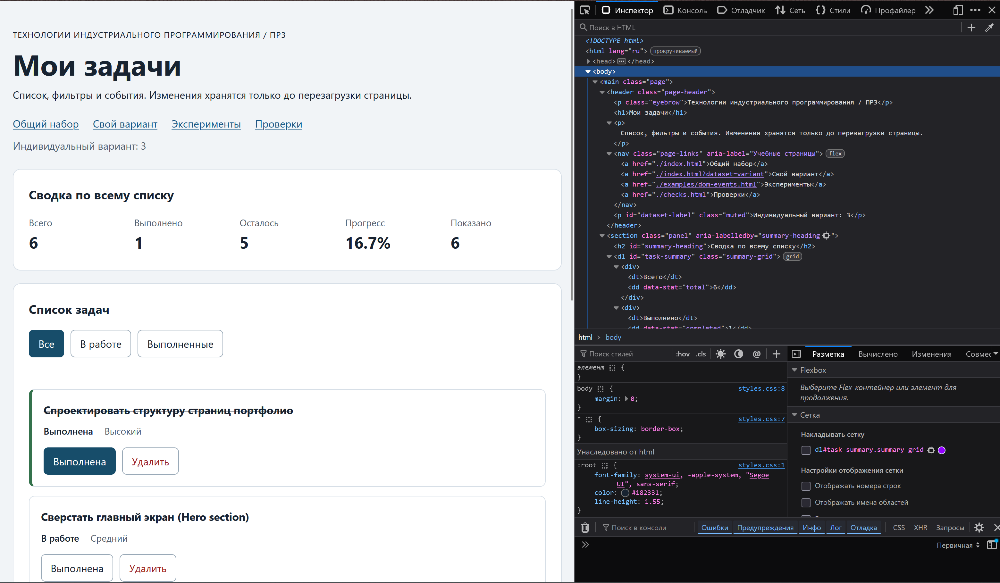

# Практическая работа № 3. Работа с DOM и событиями

## Данные работы

| Поле | Значение |
|---|---|
| Имя | Засимов Фёдор Петрович |
| Группа | ЭФБО-05-25 |
| Вариант из ПР2 | 3 |
| Node.js | v24.15.0 |
| Браузер | firefox |
| Операционная система | windows 11 |

## Запуск

Рабочая папка: `practice-03` внутри личного репозитория.

```bash
npm run check:service
npm start
```

Устанавливать зависимости через `npm install` не требуется. Для PowerShell при блокировке `npm.ps1` доступны `npm.cmd` и прямые команды `node`.

```text
http://127.0.0.1:5503/
http://127.0.0.1:5503/index.html?dataset=variant
http://127.0.0.1:5503/examples/dom-events.html
http://127.0.0.1:5503/checks.html
```

Остановка сервера: `Ctrl+C`. Если выбран другой порт, указать фактическую команду и адрес.

## Что перенесено из ПР2

Из практической работы № 2 были перенесены файлы `src/data.js` (с моим 3-м вариантом) и `src/task-service.js` (полная реализация всех 9 функций + дополнительное задание). 
Перед началом работы была выполнена команда `npm run check:service`. Результат: 35 проверок пройдено, 0 не пройдено. Исправления в логике не потребовались, так как код полностью соответствовал контрактам ПР2.

## Эксперименты

| № | До запуска: прогноз | После запуска: результат | Объяснение |
|---:|---|---|---|
| 1. Отсутствующий элемент и коллекция | `null` и длина 0 | `null` и `0` | `querySelector` возвращает `null`, если элемент не найден. `querySelectorAll` возвращает пустой статический `NodeList`, у которого `length` равен 0. |
| 2. dataset и числовой id | Строка "4", затем число 4 | Строка `"4"`, затем число `4` | Атрибуты `data-*` всегда считываются как строки. Для использования в качестве ID требуется явное преобразование через `Number()`. |
| 3. Статический NodeList | Длина не изменится | Длина осталась прежней | `NodeList`, возвращаемый `querySelectorAll`, является статическим. Он не обновляется автоматически при добавлении новых элементов в DOM. |
| 4. Строка с HTML-разметкой | Текст отобразится как есть | `<strong>Текст</strong>` | Свойство `textContent` экранирует HTML-символы. Браузер отображает теги как обычный текст, а не создаёт элементы. |
| 5. Распространение события | Сработает на кнопке и span | Target: `span`, CurrentTarget: `button` | Событие всплывает от целевого элемента (`span`) к предкам (`button`). Обработчик, назначенный на кнопку, перехватывает событие на фазе всплытия. |

## Организация кода

- `data.js`: хранит константы исходных данных (`demoTasks`, `variantTasks`) и номер варианта. Не содержит логики.
- `task-service.js`: чистые функции для работы с данными (валидация, создание, изменение, удаление). Не знает о существовании DOM.
- `task-selectors.js`: содержит функцию `getVisibleTasks`, которая возвращает новый отфильтрованный массив на основе переданного фильтра (`all`, `pending`, `completed`).
- `task-view.js`: отвечает только за создание DOM-элементов (`createTaskElement`) и обновление интерфейса (`renderTaskList`, `renderSummary`, `renderEmptyState`). Не изменяет данные и не вешает обработчики.
- `main.js`: управляет состоянием приложения (`currentTasks`, `currentFilter`), обрабатывает события через делегирование (`handleTaskListClick`, `handleFilterClick`), вызывает функции сервиса и инициирует перерисовку через `renderApp()`.

## Общий сценарий

Ожидания находятся в разделе 6.5 методички. Ниже записываются фактические результаты запуска.

| Шаг | Видимые id | Всего | Выполнено | Осталось | Прогресс | Показано | Сообщение | Совпало с ожиданием |
|---:|---|---|---|---|---|---|---|---|
| 0 | 1, 4, 7, 10 | 4 | 2 | 2 | 50.0% | 4 | (пусто) | Да |
| 1 | 4, 7 | 4 | 2 | 2 | 50.0% | 2 | (пусто) | Да |
| 2 | 7 | 4 | 3 | 1 | 75.0% | 1 | (пусто) | Да |
| 3 | 1, 4, 7, 10 | 4 | 3 | 1 | 75.0% | 4 | (пусто) | Да |
| 4 | 1, 4, 10 | 3 | 3 | 0 | 100.0% | 3 | (пусто) | Да |
| 5 | (нет) | 3 | 3 | 0 | 100.0% | 0 | Нет задач по выбранному фильтру. | Да |
| 6 | 1, 4, 10 | 3 | 2 | 1 | 66.7% | 3 | (пусто) | Да |
| 7 | (нет) | 0 | 0 | 0 | 0.0% | 0 | Список задач пуст. | Да |

**После перезагрузки:** Приложение возвращается к шагу 0. Все изменения теряются, так как в ПР3 не используется `localStorage` или сохранение на сервер.

## Индивидуальный вариант

Указать тему и исходные шесть задач. Приложить фактическую сводку после переключения `id = 23` и удаления `id = 37`.

**Тема варианта:** Создание сайта-портфолио.  
**Исходные задачи:** 6 задач (id: 11, 23, 37, 41, 58, 64). Изначально выполнены первые две (11 и 23).

| Этап | Всего | Выполнено | Осталось | Прогресс | Видимые id |
|---|---|---|---|---|---|
| До действий | 6 | 2 | 4 | 33.3% | 11, 23, 37, 41, 58, 64 |
| После переключения 23 | 6 | 1 | 5 | 16.7% | 11, 23, 37, 41, 58, 64 |
| После удаления 37 | 5 | 1 | 4 | 20.0% | 11, 23, 41, 58, 64 |
| Итог, фильтр «В работе» | 5 | 1 | 4 | 20.0% | 23, 41, 58, 64 |
| Итог, фильтр «Выполненные» | 5 | 1 | 4 | 20.0% | 11 |

## Протокол проверки сервиса

Вставить **реальный вывод** `npm run check:service`. До запуска результат не заполнен.

```text
OK: 01. Создание задачи с явным приоритетом
OK: 02. Приоритет по умолчанию
OK: 03. Удаление краевых пробелов без изменения внутренних
OK: 04. Граничные длины названия и положительный безопасный id
OK: 05. Некорректные названия при создании
OK: 06. Некорректные идентификаторы при создании
OK: 07. Все допустимые приоритеты и отклонение недопустимых
OK: 08. Каждый вызов createTask возвращает новый объект
OK: 09. Поиск по id, а не по индексу
OK: 10. Отсутствующая задача и пустой массив при поиске
OK: 11. Поиск не преобразует строковый id в число
OK: 12. Получение невыполненных задач
OK: 13. Пустой список, все выполнены и все не выполнены
OK: 14. Названия в исходном порядке и пустой список
OK: 15. Сводка по общему набору
OK: 16. Сводка по пустому списку
OK: 17. Сводка: ничего не выполнено и выполнено всё
OK: 18. Процент остаётся числом без предварительного округления
OK: 19. Добавление в конец без изменения входного массива
OK: 20. Добавление в пустой список с приоритетом по умолчанию
OK: 21. Повторяющийся id отклоняется
OK: 22. Добавление не обходит проверки createTask
OK: 23. Изменение completed в обе стороны
OK: 24. completed принимает только boolean
OK: 25. Некорректный или отсутствующий id при изменении статуса
OK: 26. Повторная установка статуса создаёт новый результат
OK: 27. Переименование сохраняет остальные поля
OK: 28. Проверки названия при переименовании
OK: 29. Некорректный или отсутствующий id при переименовании
OK: 30. Удаление по id с сохранением порядка
OK: 31. Удаление единственной записи
OK: 32. Некорректный, отсутствующий id и удаление из пустого списка
OK: 33. Входные объекты не изменяются ни одной операцией
OK: 34. Общий сценарий и все промежуточные сводки
OK: 35. Работа с другим набором, без зависимости от demoTasks

Проверок пройдено: 35; не пройдено: 0.
```

## Протокол браузерных проверок

Вставить **реальный текст** из блока «Текстовый протокол» на `checks.html`.

```text
OK: Фильтр all возвращает новый массив в исходном порядке
OK: Фильтр pending выбирает невыполненные задачи
OK: Фильтр completed выбирает выполненные задачи
OK: Все три фильтра работают с пустым списком
OK: Фильтрация не меняет входные записи и их порядок
OK: Карточка — li.task-card с числовым id в dataset
OK: Статус невыполненной карточки и aria-pressed согласованы
OK: Статус выполненной карточки и aria-pressed согласованы
OK: В карточке две обычные кнопки с вложенными подписями
OK: Все приоритеты отображаются по установленному словарю
OK: Название с разметкой отображается текстом
OK: Отрисовка списка создаёт карточки в исходном порядке
OK: Повторная отрисовка не накапливает карточки
OK: Контейнер списка и его обработчик сохраняются
OK: Отрисовка пустого массива очищает прежние карточки
OK: Сводка считается по всему списку, отдельно выводится Показано
OK: Пустая сводка не содержит NaN и Infinity
OK: Сообщение для полностью пустого списка
OK: Сообщение для пустого результата фильтра
OK: Появление карточек скрывает прежнее пустое состояние
OK: Приложение: начальный набор и сводка
OK: Приложение: фильтр срабатывает по клику на вложенный span
OK: Приложение: активный фильтр отмечен классом и aria-pressed
OK: Приложение: фильтрация не удаляет скрытые задачи
OK: Приложение: переключение по id, а не индексу массива
OK: Приложение: выполненная задача исчезает из фильтра В работе
OK: Приложение: удаление изменяет данные, а не только DOM
OK: Приложение: клик по названию не изменяет данные
OK: Приложение: после перерисовок одно нажатие — одно изменение
OK: Приложение: удаление всех записей и нулевая сводка
OK: Приложение: нет совпадений — не то же самое, что нет задач
OK: Приложение: неизвестный числовой id не меняет данные
OK: Приложение: id 4abc не превращается в 4
OK: Приложение: неизвестное действие игнорируется
OK: Приложение: после изменения сохраняется клавиатурный фокус
OK: Приложение: новая загрузка возвращает исходное состояние

Всего: 36. Пройдено: 36. Ошибок: 0.
```

## Собственные проверки

| № | Исходное состояние и действия | Ожидаемый результат | Фактический результат | Итог |
|---:|---|---|---|---|
| 1 (Граничное) | Удалить все задачи по одной, пока список не опустеет. | Появится сообщение «Список задач пуст.», сводка покажет нули. | Сообщение появилось, сводка: 0 / 0 / 0 / 0.0%. | Пройдено |
| 2 (Событие) | Кликнуть не по самой кнопке «Удалить», а по тексту `span` внутри неё. | Задача удалится благодаря делегированию и методу `closest`. | Задача успешно удалена, DOM обновился. | Пройдено |
| 3 (Состояние) | Переключить фильтр на «В работе», выполнить задачу, переключить на «Все». | Выполненная задача должна исчезнуть из «В работе» и появиться в «Все». Общий прогресс вырастет. | Задача переместилась, общий прогресс пересчитан корректно, данные не потеряны. | Пройдено |

Минимум один случай — граничное состояние, один — событие или повторная отрисовка.

## Отладка и клавиатура

Указать строку точки останова и полученные значения `event.target`, `event.currentTarget`, `dataset.taskId`, числового `id`, действия и результата сервиса.

Описать проверку Tab, Enter и Space, а также положение фокуса после изменения статуса и удаления. Отдельно зафиксировать отказ для `777` и `4abc` в атрибуте карточки.

**Отладка через DevTools:**  
Точка останова установлена на строке чтения `const id = Number(card.dataset.taskId);` в `handleTaskListClick`.  
При клике на кнопку удаления задачи с `id="4"` зафиксированы значения:
- `event.target`: `<span class="action-label">Удалить</span>`
- `event.currentTarget`: `<button type="button" data-action="delete">...</button>`
- `card.dataset.taskId`: строка `"4"`
- Числовой `id`: число `4`
- Результат `removeTask`: `{ ok: true, tasks: [...] }` (массив без задачи 4).

**Клавиатура:**  
Элементы `<button>` по умолчанию фокусируются клавишей `Tab`. Активация выполняется клавишами `Enter` или `Space`. После выполнения действия (например, переключения статуса) фокус возвращается на соответствующую кнопку той же задачи благодаря вызову `restoreTaskFocus`. При удалении задачи фокус передаётся на активную кнопку фильтра.

**Проверка некорректного ID:**  
Через DevTools (вкладка Elements) атрибут `data-task-id` у карточки был временно изменён на `777` и `4abc`. При клике на кнопку выводится сообщение об ошибке («Задача не найдена» или «некорректный идентификатор»), массив `currentTasks` не изменяется. После смены фильтра карточка пересоздаётся с корректным ID из исходного массива.

## Вид приложения

Добавить изображение или демонстрацию, полученную после собственного запуска. Не вставлять изображение ожидаемого результата как собственный фактический результат.


## Дополнительное задание

Выполнен **Вариант Б: Однократная отмена последнего удаления**.

**Правила поведения:**
1. При успешном удалении задачи её копия и исходный индекс сохраняются в переменной состояния `lastDeletedRecord`.
2. Кнопка «Отменить удаление» становится активной (`disabled = false`).
3. При нажатии на кнопку отмены задача вставляется обратно в массив `currentTasks` методом `splice` строго на свой исходный индекс.
4. После отмены запись об удалении обнуляется, кнопка снова блокируется, а интерфейс перерисовывается. Новое удаление перезаписывает возможность отмены предыдущего.

**Собственные проверки расширения:**

| № | Исходное состояние и действия | Ожидаемый результат | Фактический результат | Итог |
|---:|---|---|---|---|
| 1 | Удалить задачу, нажать «Отменить удаление». | Задача возвращается на исходную позицию, кнопка блокируется. | Задача вернулась, кнопка серая, порядок элементов сохранен. | Пройдено |
| 2 | Удалить задачу, переключить фильтр, нажать «Отменить». | Задача восстанавливается в общем массиве, текущий фильтр корректно отображает обновленный список. | Задача восстановлена, фильтр «В работе» показывает актуальные данные. | Пройдено |
| 3 | Удалить задачу, выполнить другое действие (смену статуса), нажать «Отменить». | Отменяется именно последнее удаление, изменение статуса сохраняется. | Статус другой задачи изменен, удаленная задача вернулась на место. | Пройдено |

## Вывод

В ходе работы был создан браузерный интерфейс для управления задачами. Главный результат — успешное разделение ответственности: модуль `task-service.js` остался «чистым» (без DOM-зависимостей), а вся работа с элементами страницы инкапсулирована в `task-view.js` и `main.js`. 

Освоено делегирование событий: один обработчик на контейнере `#task-list` эффективно обрабатывает клики по динамически создаваемым кнопкам, в том числе по вложенным элементам (`span`), благодаря использованию `event.target.closest()`. 

Проверено, что изменение DOM (например, визуальное скрытие элемента) не равно изменению данных: реальное удаление или изменение статуса происходит только после успешного выполнения функций `task-service.js` и обновления массива `currentTasks`, за которым следует полная перерисовка (`renderApp`). Это гарантирует согласованность интерфейса и данных.
