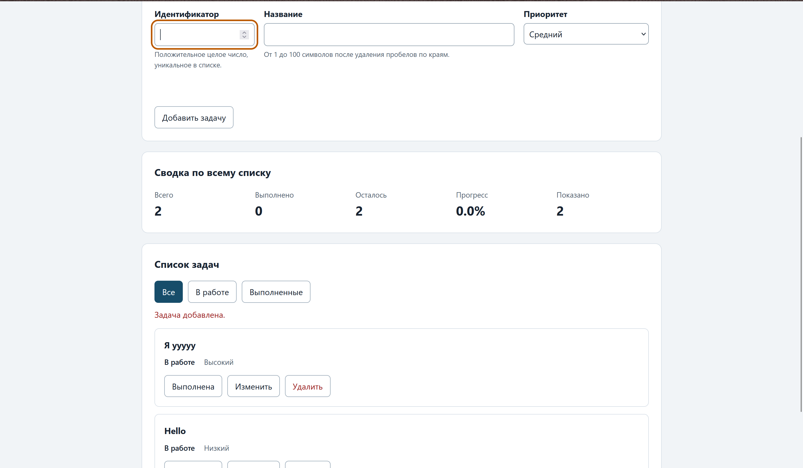
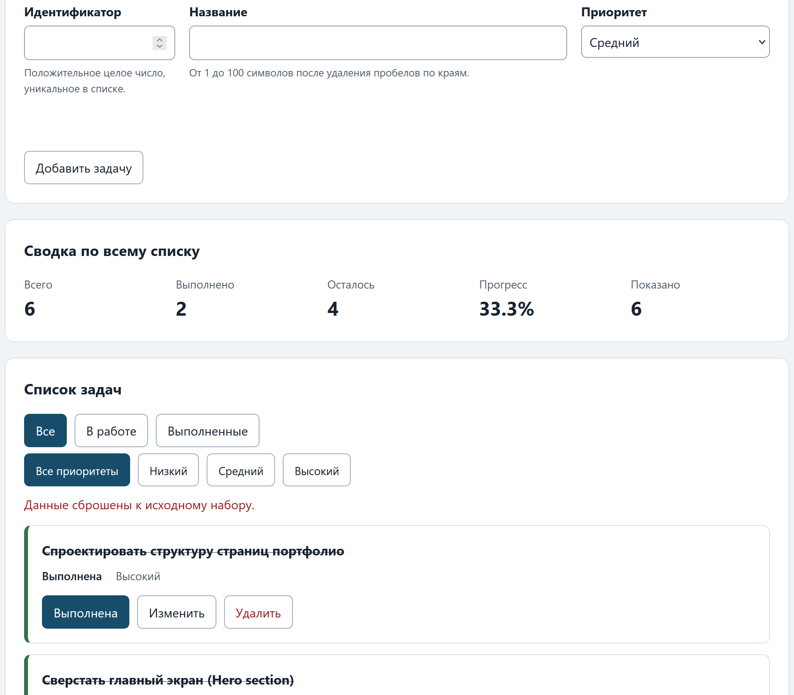

# Практическая работа № 4. Формы, валидация и локальное хранение данных

## Данные работы

| Поле | Значение |
|---|---|
| Имя | Засимов Фёдор Петрович |
| Группа | ЭФБО-05-25 |
| Вариант из ПР2–ПР3 | 3 |
| Node.js | v24.15.0 |
| Браузер | Firefox |
| Операционная система | Windows 11 |

## Запуск

Рабочая папка: `practice-04` внутри личного репозитория.

```bash
npm run check:service
npm run check:modules
npm start
```

Устанавливать зависимости через `npm install` не требуется.

```text
http://127.0.0.1:5504/
http://127.0.0.1:5504/index.html?dataset=variant
http://127.0.0.1:5504/examples/forms-storage.html
http://127.0.0.1:5504/checks.html
```
*(Примечание: порт 5504 используется, так как 5503 был занят. Если порт отличается, фактический адрес указан в терминале при запуске).*

## Перенос результата ПР3

| Файл | Что перенесено или изменено |
|---|---|
| `data.js` | Перенесён без изменений. Содержит `demoTasks`, `variantTasks` (Вариант 3) и `variantNumber`. |
| `task-service.js` | Перенесены все 9 функций из ПР2/ПР3. Добавлена новая функция `updateTask` для изменения названия и приоритета без сброса статуса `completed`. |
| `task-selectors.js` | Перенесена функция `getVisibleTasks` без изменений. |
| `task-view.js` | Перенесены функции отрисовки. В `createTaskElement` добавлена третья кнопка с `data-action="edit"` и текстом «Изменить». |

## Эксперименты с формой и хранилищем

| № | До запуска: прогноз | После запуска: результат | Объяснение |
|---:|---|---|---|
| 1. Пустое обязательное поле | Браузер заблокирует отправку | Появляется всплывающая подсказка браузера «Заполните это поле» | Атрибут `required` включает нативную Constraint Validation API до срабатывания события `submit`. |
| 2. Название из пробелов | Форма отправится, но будет ошибка | Форма отправляется, но появляется текст ошибки под полем «Название должно содержать от 1 до 100 символов» | Нативная проверка считает пробелы валидной строкой. Прикладная проверка `validateTaskDraft` использует `.trim()` и отклоняет пустой результат. |
| 3. Типы значений `FormData` | Число останется числом | Все значения имеют тип `string` (даже из `<input type="number">`) | `FormData` всегда собирает значения как строки. Явное преобразование через `Number()` обязательно. |
| 4. Строка в `localStorage` и JSON | Объект сохранится как объект | В DevTools Application видно строку вида `{"version":1,"tasks":[...]}` | `localStorage` хранит только строки. Для сохранения объектов требуется `JSON.stringify`, для чтения — `JSON.parse`. |
| 5. Повреждённый JSON | Приложение упадёт с ошибкой | Приложение загружается с исходными данными, вверху видно предупреждение | Блок `try...catch` в `loadTasks` перехватывает ошибку `JSON.parse` и возвращает резервный набор (`fallbackTasks`). |

## Организация кода

- `task-service.js`: Чистая бизнес-логика. Не знает о DOM или хранилище.
- `form-validation.js`: Прикладная валидация черновика. Проверяет уникальность ID, длину строки и допустимые значения, возвращая объект с детальными ошибками по полям.
- `task-storage.js`: Отвечает за сериализацию и десериализацию. Проверяет схему данных после чтения из JSON.
- `task-view.js`: Отвечает только за создание и обновление DOM-элементов.
- `main.js`: Оркестратор. Обрабатывает события, управляет состоянием (`currentTasks`, `editingId`), вызывает сервисы и инициирует сохранение.

**Почему функции хранения получают объект `storage` аргументом?**  
Это внедрение зависимостей (Dependency Injection). Это позволяет тестировать модуль `task-storage.js` с помощью поддельного объекта (mock), не загрязняя глобальный `window.localStorage` тестовыми данными и делая код модульным.

**Почему данные из JSON проверяются до использования?**  
Успешный `JSON.parse` гарантирует только синтаксическую корректность строки. Пользователь мог вручную изменить данные в DevTools, добавив задачи с некорректными типами или дублирующимися ID. Проверка схемы (`isValidTaskList`) предотвращает падение приложения при попытке отрисовать или отфильтровать «мусорные» данные.

## Проверка формы

| Сценарий | Ожидаемый результат | Фактический результат | Итог |
|---|---|---|---|
| Добавление корректной задачи | Задача появляется в списке, форма очищается, данные сохраняются | Задача добавлена, форма сброшена в режим создания, статус хранилища «сохранено» | Пройдено |
| Повторяющийся id | Отказ без изменения списка, ошибка под полем ID | Появилась ошибка «Задача с таким ID уже существует», список не изменился | Пройдено |
| Пустое название | Отказ нативной проверки | Браузер показал подсказку «Заполните это поле», отправка заблокирована | Пройдено |
| Название из пробелов | Отказ прикладной проверки | Появилась ошибка валидации под полем, задача не добавлена | Пройдено |
| Название длиной 100 | Успех | Задача успешно добавлена | Пройдено |
| Название длиной 101 | Отказ | Появилась ошибка валидации, задача не добавлена | Пройдено |
| Редактирование title и priority | Меняется одна задача, статус `completed` сохраняется | Название и приоритет обновлены, галочка выполнения осталась на месте | Пройдено |
| Отмена редактирования | Возврат к пустой форме создания | Форма очищена, поле ID разблокировано, фокус в поле ID | Пройдено |

## Общий сценарий

| Шаг | Действие | Видимые id | Всего | Выполнено | Осталось | Прогресс | Состояние storage |
|---:|---|---|---:|---:|---:|---:|---|
| 0 | Исходный запуск после сброса | 1, 4, 7, 10 | 4 | 2 | 2 | 50.0% | initial |
| 1 | Добавление `id = 20` | 1, 4, 7, 10, 20 | 5 | 2 | 3 | 40.0% | saved |
| 2 | Отказ для повторного `id = 4` | 1, 4, 7, 10, 20 | 5 | 2 | 3 | 40.0% | saved (без изменений) |
| 3 | Редактирование `id = 4` | 1, 4, 7, 10, 20 | 5 | 2 | 3 | 40.0% | saved |
| 4 | Переключение `id = 7` (выполнена) | 1, 4, 7, 10, 20 | 5 | 3 | 2 | 60.0% | saved |
| 5 | Удаление `id = 1` | 4, 7, 10, 20 | 4 | 3 | 1 | 75.0% | saved |
| 6 | Перезагрузка страницы | 4, 7, 10, 20 | 4 | 3 | 1 | 75.0% | loaded from storage |
| 7 | Сброс данных | 1, 4, 7, 10 | 4 | 2 | 2 | 50.0% | initial (ключ удалён) |

## Проверка восстановления и ошибок

| Случай | Ожидание | Фактический результат | Итог |
|---|---|---|---|
| Записи нет | Используется независимая копия исходного набора | Загружен `demoTasks`, статус «начальный набор» | Пройдено |
| Корректная запись | Данные восстанавливаются после перезагрузки | После F5 список и статусы идентичны состоянию до перезагрузки | Пройдено |
| Повреждённый JSON | Приложение запускается с исходным набором и предупреждением | Вверху страницы появилось предупреждение, загружен резервный набор | Пройдено |
| Неверная версия или схема | Исходный набор и предупреждение | При ручной подмене `version` в DevTools сработал fallback | Пройдено |
| Сброс | Удаляется только ключ текущего набора | Ключ `tasks-demo` удалён, ключ варианта (если открыт) остался нетронутым | Пройдено |
| Общий и индивидуальный наборы | Изменения не смешиваются | Данные варианта хранятся под ключом `tasks-variant-3`, общий под `tasks-demo` | Пройдено |

## Индивидуальный вариант

**Тема:** Создание сайта-портфолио (Вариант 3).  
**Исходные задачи:** 6 задач (id: 11, 23, 37, 41, 58, 64). Изначально выполнены задачи 11 и 23.

| Этап | Всего | Выполнено | Осталось | Прогресс | Видимые id |
|---|---:|---:|---:|---:|---|
| Исходный набор | 6 | 2 | 4 | 33.3% | 11, 23, 37, 41, 58, 64 |
| После добавления `75` | 7 | 2 | 5 | 28.6% | 11, 23, 37, 41, 58, 64, 75 |
| После редактирования `23` | 7 | 2 | 5 | 28.6% | 11, 23, 37, 41, 58, 64, 75 |
| После удаления `37` | 6 | 2 | 4 | 33.3% | 11, 23, 41, 58, 64, 75 |
| После перезагрузки | 6 | 2 | 4 | 33.3% | 11, 23, 41, 58, 64, 75 |
| После сброса | 6 | 2 | 4 | 33.3% | 11, 23, 37, 41, 58, 64 |

## Протокол проверок сервиса

```text
OK: 01. Создание задачи с явным приоритетом
OK: 02. Приоритет по умолчанию
OK: 03. Удаление краевых пробелов без изменения внутренних
OK: 04. Граничные длины названия и положительный безопасный id
OK: 05. Некорректные названия при создании
OK: 06. Некорректные идентификаторы при создании
OK: 07. Все допустимые приоритеты и отклонение недопустимых
OK: 08. Каждый вызов createTask возвращает новый объект
OK: 09. Поиск по id, а не по индексу
OK: 10. Отсутствующая задача и пустой массив при поиске
OK: 11. Поиск не преобразует строковый id в число
OK: 12. Получение невыполненных задач
OK: 13. Пустой список, все выполнены и все не выполнены
OK: 14. Названия в исходном порядке и пустой список
OK: 15. Сводка по общему набору
OK: 16. Сводка по пустому списку
OK: 17. Сводка: ничего не выполнено и выполнено всё
OK: 18. Процент остаётся числом без предварительного округления
OK: 19. Добавление в конец без изменения входного массива
OK: 20. Добавление в пустой список с приоритетом по умолчанию
OK: 21. Повторяющийся id отклоняется
OK: 22. Добавление не обходит проверки createTask
OK: 23. Изменение completed в обе стороны
OK: 24. completed принимает только boolean
OK: 25. Некорректный или отсутствующий id при изменении статуса
OK: 26. Повторная установка статуса создаёт новый результат
OK: 27. Переименование сохраняет остальные поля
OK: 28. Проверки названия при переименовании
OK: 29. Некорректный или отсутствующий id при переименовании
OK: 30. Удаление по id с сохранением порядка
OK: 31. Удаление единственной записи
OK: 32. Некорректный, отсутствующий id и удаление из пустого списка
OK: 33. Входные объекты не изменяются ни одной операцией
OK: 34. Общий сценарий и все промежуточные сводки
OK: 35. Работа с другим набором, без зависимости от demoTasks

Проверок пройдено: 35; не пройдено: 0.
```

## Протокол проверок новых модулей

```text
OK: 01. updateTask изменяет название и приоритет выбранной задачи
OK: 02. updateTask нормализует название и сохраняет completed
OK: 03. updateTask не изменяет входной массив и объекты
OK: 04. updateTask отклоняет некорректный и отсутствующий id
OK: 05. updateTask отклоняет некорректные название и приоритет
OK: 06. Валидация создания нормализует поля
OK: 07. Валидация отклоняет некорректные id
OK: 08. Валидация отклоняет повторяющийся id при создании
OK: 09. Валидация проверяет название после trim
OK: 10. Валидация принимает только три приоритета
OK: 11. В режиме редактирования используется editingId
OK: 12. Редактирование отсутствующей задачи отклоняется
OK: 13. Валидация не изменяет draft и список
OK: 14. Проверка схемы принимает корректный список
OK: 15. Проверка схемы отклоняет неверную структуру
OK: 16. Отсутствующая запись возвращает независимую копию исходных данных
OK: 17. Корректная запись восстанавливается из хранилища
OK: 18. Повреждённый JSON приводит к безопасному fallback
OK: 19. Неизвестная версия приводит к безопасному fallback
OK: 20. Некорректные задачи из JSON не принимаются
OK: 21. Ошибка getItem перехватывается
OK: 22. Сохранение записывает версию и задачи
OK: 23. Некорректный список не записывается
OK: 24. Ошибка setItem перехватывается
OK: 25. Удаляется только переданный ключ
OK: 26. Ошибка removeItem перехватывается
OK: 27. Результат загрузки не разделяет объекты с fallback

Проверок пройдено: 27; не пройдено: 0.
```

## Протокол браузерных проверок

```text
OK: Фильтры ПР3 сохраняют порядок и не изменяют вход
OK: Карточка содержит toggle, edit и delete
OK: Название задачи выводится как текст
OK: Повторная отрисовка списка не накапливает карточки
OK: Сводка использует полный список и отдельный visibleCount
OK: Пустые состояния различают список и фильтр
OK: Приложение запускается с исходным набором
OK: Корректная форма добавляет задачу и сохраняет данные
OK: Повторяющийся id отклоняется без записи
OK: Название из пробелов отклоняется прикладной проверкой
OK: Нативные ограничения не пропускают пустую форму
OK: Кнопка edit заполняет форму и блокирует id
OK: Редактирование меняет title и priority, сохраняя completed
OK: Отмена редактирования возвращает режим создания
OK: Успешная отправка очищает ошибки и форму
OK: Изменение статуса сохраняется
OK: Удаление сохраняется
OK: Фильтр не записывается, но сохраняется после изменения данных
OK: Перезагрузка восстанавливает сохранённые задачи
OK: Сброс удаляет ключ и восстанавливает исходный набор
OK: Повреждённый JSON не ломает запуск
OK: Некорректная схема из storage заменяется исходным набором
OK: Общий и индивидуальный наборы используют разные ключи
```

## Собственные проверки

| № | Исходное состояние и действия | Ожидаемый результат | Фактический результат | Итог |
|---:|---|---|---|---|
| 1 (Граница формы) | Ввести в ID значение `0`, `-5` или `1.5`. | Прикладная валидация отклонит черновик, так как требуется положительное безопасное целое число. | Появилась ошибка валидации, задача не добавлена. | Пройдено |
| 2 (Восстановление) | Добавить задачу, перезагрузить страницу, удалить эту задачу, снова перезагрузить. | Задача должна присутствовать после 1-й перезагрузки и отсутствовать после 2-й. | Состояние корректно синхронизировано с localStorage на обоих этапах. | Пройдено |
| 3 (Повреждённые данные) | В DevTools вручную изменить JSON в localStorage, удалив поле `title` у одной из задач. Перезагрузить страницу. | `isValidTaskList` вернёт `false`, приложение загрузит резервный набор и покажет предупреждение. | Появилось предупреждение о некорректных данных, загружен исходный набор. | Пройдено |

## Отладка и клавиатура

**Отладка формы:**  
Точка останова установлена в `handleFormSubmit` на строке `const validation = validateTaskDraft(...)`.  
При попытке добавить задачу с ID `4` (существующий):
- Сырой `draft`: `{ id: "4", title: "Тест", priority: "low" }` (обрати внимание, `id` — строка).
- Результат `validateTaskDraft`: `{ ok: false, errors: { id: "Задача с таким ID уже существует" } }`.
- Сервисная операция не вызывается, данные не меняются.

**Клавиатура:**  
- Навигация по полям формы осуществляется клавишей `Tab`.
- Отправка формы работает по нажатию `Enter` в любом текстовом поле.
- При переходе в режим редактирования (`setFormMode(id)`) фокус автоматически передаётся в поле названия (`titleInput.focus()`).
- При нажатии «Отменить редактирование» фокус возвращается в поле ID новой задачи.
- Кнопки действий в карточках активируются клавишей `Space` или `Enter`, фокус после перерисовки сохраняется благодаря `restoreTaskFocus`.

## Вид приложения





## Дополнительное задание

Выполнен **Вариант А: Дополнительный фильтр по приоритету**.

**Правила поведения:**
1. Добавлена вторая группа кнопок `#priority-filters` с режимами `all`, `low`, `medium`, `high`. Она размещена отдельно от `#task-filters`, чтобы не менять контракт обязательной части.
2. В `main.js` введено новое состояние `currentPriorityFilter`. Фильтры по статусу и приоритету применяются последовательно: сначала `getVisibleTasks` (из ПР3), затем дополнительная фильтрация по `priority`.
3. Общая сводка (`#task-summary`) по-прежнему рассчитывается по полному массиву `currentTasks`, а счётчик «Показано» — по результату совместной выборки.
4. Активное состояние кнопок приоритета синхронизировано через класс `is-active` и атрибут `aria-pressed`, аналогично фильтрам статуса.
5. Фильтр приоритета не сохраняется в `localStorage` (как и фильтр статуса). При сбросе данных оба фильтра возвращаются в режим «Все».

**Собственные проверки расширения:**

| № | Исходное состояние и действия | Ожидаемый результат | Фактический результат | Итог |
|---:|---|---|---|---|
| 1 | Выбрать «Высокий» в фильтрах приоритета. | Отображаются только задачи с `priority: "high"`. Сводка «Всего» не меняется, «Показано» уменьшается. | Показаны только задачи высокого приоритета, общий прогресс сохранён. | Пройдено |
| 2 | Выбрать «В работе» + «Высокий». | Отображаются только невыполненные задачи высокого приоритета. | Показаны задачи, у которых `completed: false` и `priority: "high"`. | Пройдено |
| 3 | Выбрать «Низкий», выполнить одну задачу, переключить на «Высокий». | Задача остаётся в общем массиве, меняется только видимость. После возврата в «Все приоритеты» она снова видна. | Задача не потеряна, общий массив сохранён, видимость корректно меняется. | Пройдено |
| 4 | Нажать «Сбросить данные». | Оба фильтра возвращаются в режим «Все», список показывает все задачи. | Оба фильтра сброшены, список полный. | Пройдено |

## Вывод

В ходе работы приложение было расширено полноценным интерфейсом ввода и сохранения данных. 

Главное, что было усвоено: **валидация должна быть многоуровневой**. 
1. **Нативная проверка HTML** (`required`, `type="number"`) обеспечивает базовый UX и работу с клавиатуры.
2. **Прикладная валидация** (`validateTaskDraft`) гарантирует соблюдение бизнес-правил (уникальность ID, длина строки после `trim`), которые HTML проверить не может.
3. **Валидация при чтении из хранилища** (`isValidTaskList`) защищает приложение от краха из-за повреждённых или намеренно искажённых пользователем данных JSON, обеспечивая надёжный fallback к исходному состоянию.

Разделение ответственности между модулями позволило добавить сложную логику форм и `localStorage`, не затронув и не усложнив проверенные функции `task-service.js`.